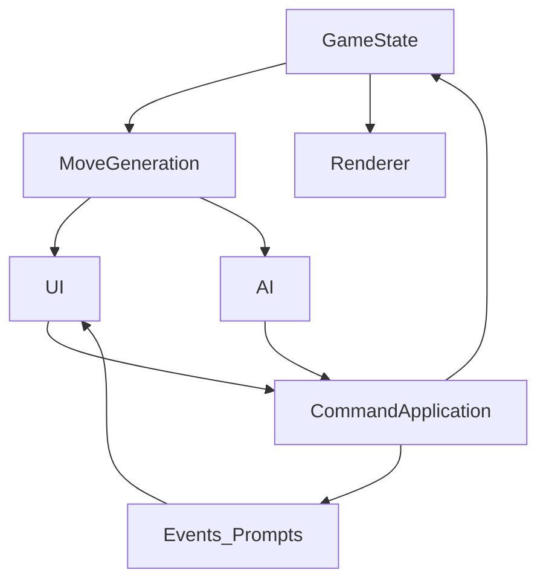

# Mortgage Crisis — Build Plan (MVP1)

This document captures the **shared MVP1 spec** and a **piece-by-piece implementation plan** for building Mortgage Crisis (Monopoly Deal–inspired) on **TIC-80 JS**.

Documentation convention (for future phases):

- `docs/phaseXX.md` should record **everything implemented** in that phase (detailed).
- `docs/plan.md` should include **minimal Phase summary bullets** (scan-friendly; link to the phase doc).
- Keep phase docs **current and non-contradictory**. It’s fine to edit older phase docs to correct factual statements when architecture/conventions change.

## Current progress

- **Phase 00 ✅**: build pipeline + committed `game.js` artifact + minimal boot cart + `node --test` scaffold. See `docs/phase00.md`.
- **Phase 01 ✅**: deterministic RNG (xorshift32) + shuffle + tests + `saveid` metadata injection. See `docs/phase01.md`.
- **Phase 02 ✅**: rules engine + command API + scenarios + debug screen + tests. See `docs/phase02.md`.
- **Phase 03 ✅**: rendering baseline (5-row layout), navigation + camera, mini-card templates, rent special rendering, and draw-call render tests. See `docs/phase03.md`.
- **Phase 03b ✅**: center-panel “big preview” + card backs + deck + discard rendering. See `docs/phase03b.md`.
- **Phase 03c ✅**: bridge rules polish (empty-hand draw-5, end-turn hand cap) + debug stepping realism. See `docs/phase03c.md`.
- **Phase 04 ✅**: UI-owned controller UX (menus/targeting/inspect) + injected controls; renderer is display-only (bounded to existing commands). See `docs/phase04.md`.
- **Phase 05 ✅**: Inspect overlay becomes a real panel (config-driven, small-font desc) + improved card copy + rule-note gating + pile count digit offset. See `docs/phase05.md`.
- **Phase 05b ✅**: turn loop framing + discard-down-to-7 prompt + deterministic reshuffle + toast/prompt foundation polish. See `docs/phase05b.md`.
- **Phase 05c ✅**: draw + reshuffle visibility (staged dealing + shuffle toast/animation), plus renderer‑oblivious animation presentation. See `docs/phase05c.md`.
- **Phase 06 ✅**: debt/payment prompt + recipient “faux-turn placement” for received properties (incl. Wild color choice), using prompt actor `prompt.p` (not `activeP`). See `docs/phase06.md`.
- **Phase 07 ✅**: AI (random legal) + narrated pacing, plus Phase 07 UX/focus polish. See `docs/phase07.md`.
- **Phase 08 ✅**: Actions + responses: Sly Deal targeting + Just Say No response windows (Sly prompt + Rent-in-payDebt), plus related UI/focus/policy knobs. See `docs/phase08.md`.
- **Phase 09 ✅**: Low-risk UX tidy-ups: DebugText layout/wrapping, debug Next keeps cursor on Next, moveStress Sly target richness, and hold‑A Sly no-target flow starts at Bank (hold-chain). See `docs/phase09.md`.
- **Phase 10 ✅**: Wild replace-window prompt + moveWild targeting (incl. Source-cancel consistency) + eligibility/AI/tests polish. See `docs/phase10.md`.
- **Phase 11 ✅**: Quick wins: rename to Mortgage Crisis + `MC` namespace, HUD version string, AI prompt prefix (`AI:`), AI debt payment bias toward bank, Source-only disallow, and early-turn AI heuristics (Rent gating, early discipline, Sly bias). See `docs/phase11.md`.
- **Phase 12 ✅**: Title screen (boot-first) with static menu + controls list. See `docs/phase12.md`.

### Deferred-items capture (scope creep safety net)

When we decide “this is post‑Demo / Phase 20”, we must **immediately** capture it in this doc so it doesn’t get lost.

- Add a bullet under **Phase 20 — Features wishlist** (or a later phase if more appropriate).
- Prefix with `Deferred:` and keep it concrete (1 sentence, includes where it shows up).
- If we end up implementing it earlier (e.g. Phase 09), delete/move the deferred bullet.

## Goals + Constraints

- **Platform**: TIC-80 fantasy console, **JavaScript** (historically Duktape; many newer builds use QuickJS — we still write ES5-style for broad compatibility)
- **Cartridge**: single pasted file output **`game.js`**
- **Constraints**: no DOM/Node/browser APIs, no external libs, 8 banks of 64KB code limit
- **Target**: **1v1 player vs AI**, controller-first (Google TV couch play)
- **UI space**: 240×136 usable area
- **Sprites**: `print()` text cannot be rotated 180°; use **sprites** for card values/rent/icons (rotate sprites with `spr(..., rotate=2)` for opponent). See `docs/sprites.md`.

### Naming conventions (codebase)

- **Namespaces / enums**: PascalCase objects (e.g. `MC.ActionKind`, `MC.CardKind`)
- **Scalar constants**: ALL_CAPS (e.g. `MC.HOUSE_RENT_BONUS`)
- **Functions**: camelCase (avoid baking internal entrypoint names into docs; prefer describing behavior/contracts)

### Engineering guardrails (cartridge hygiene)

- **No runtime fallbacks**: avoid `x = x || {}`, `|| []`, “should never happen” defaults in runtime code. Prefer canonical constructors/canonicalizers plus tests.
- **No runtime shape asserts**: don’t ship “assert shape” helpers in `game.js`; enforce invariants in unit tests.
- **Numeric coercion**: keep `|0` / `>>>0` localized to TIC-80 draw-call boundary wrappers (e.g. `rectSafe`, `sprSafe`) and deterministic engine/RNG hot spots.
- **Namespaces**: module namespaces are created once in the prelude; don’t repeat `MC.ui = MC.ui || {}`-style guards in modules.
- **Build artifact rule**: after any change in `src/` or `scripts/build.mjs`, run `npm test` and `npm run build` so committed `game.js` stays in sync.

## Locked MVP1 Rules (Source of Truth)

### Win condition

- Win = **first player to 3 complete property sets**
- **Win check** runs after **every state change** that can affect sets/properties (including during debt/payment resolution), to avoid continuing after a win.

### Game start

- Shuffle deck
- Deal **5** cards to each player
- Choose first player **randomly** (uses our deterministic PRNG; seed is a constant in MVP1)

### Turn structure

- Start of turn: **draw 2** (or **draw 5** if you start the turn with **0 cards in hand**)
- Main phase: **play up to 3 cards**
- End phase: **discard down to 7** (you cannot end the turn while your hand is **>7**)

### MVP1 card pool (35-card deck)

#### Property ecosystem (14 property cards total)

Property sets in MVP1:

- **Magenta**: requires **3**
- **Orange**: requires **3**
- **Cyan**: requires **2**
- **Black**: requires **4**

Wild properties:

- **1×** dual-color **Magenta/Orange**
- **1×** dual-color **Cyan/Black**

Notes:

- **Overfill allowed**: a set/stack may exceed its required size; it is still one set.
- Rent calculation caps at the required size (see rent rules).

#### Buildings

- **House ×2** (House only in MVP1; no Hotel)

House rules:

- Can be played only onto a **completed** set
- **House bonus** adds to rent (see rent tables)
- If paying a debt from a set with a House, the owner must **pay/remove the House first**
  - House payment goes to the recipient’s **bank** (as money)

#### Action cards

Included action cards:

- **Rent** ×5 (2× Magenta/Orange, 2× Cyan/Black, 1× Any)
- **Sly Deal** ×2
- **Just Say No** ×2

Just Say No (JSN):

- **Single-layer** only (no JSN-on-JSN chain in MVP1)
- Played from **hand** in a response window
- Does **not** consume plays (reaction, not an active-turn play)
- When JSN cancels an action: **both JSN and the canceled action go to discard**

#### Money cards

- **Money ×10**
- Values are small; **no 10-value** money in MVP1
- Recommended distribution: **1×3, 2×3, 3×2, 4×1, 5×1**

### Banking rules

- Bankable: **Money cards**, **Action cards**, and **House**
- Not bankable: **Property cards** (including Wilds)

### Debt/payment rules

- When a player owes money (e.g., Rent), the **payer chooses** what to pay with.
- Payment sources: **bank + properties only** (not hand).

Where paid cards go:

- Paid **money/actions/house** → recipient **bank**
- Paid **properties** → recipient **properties**

Placement UX for received properties:

- **No auto-placement in MVP1**
- Recipient performs an explicit **“faux-turn placement”** for each received property:
  - choose destination set or create new set
  - if Wild, choose active color and destination

### Rent rules (MVP1)

- Rent can be charged from **partial sets** (rent scales with current set size)
- Overfill does **not** increase rent beyond the set’s required size (rent caps at required size)

Concrete rent tables (Option A):

- **Cyan(2)**: 1, 3]
- **Magenta(3)**: 1, 2, 4]
- **Orange(3)**: 2, 3, 5]
- **Black(4)**: 1, 2, 3, 6]
- **House bonus**: **+3** (only when charging rent from a completed set that has a House)

### Property money values (for debt payment)

Properties are not bankable, but they have money values used to satisfy debts when paid as properties.

- Cyan properties: **more valuable than others** (exact number to tune; initial default **3M each**)
- Magenta properties: initial default **2M each**
- Orange properties: initial default **2M each**
- Black properties: initial default **1M each**
- Wild (M/O): initial default **2M**
- Wild (C/B): initial default **2M**

### Wild “replace-window” repositioning

Wild repositioning is intentionally constrained in MVP1.

- Repositioning is only available in a **replace-window** after playing a property into a set (including playing a Wild).
- At most **1 Wild** may be repositioned per play.
- Repositioning is included in the **same play** (no additional play cost).
- Player **chooses destination** (existing set or new set + color assignment).
- **Eligibility**: repositioning is only legal if removing the Wild would leave the **source set still complete**.

### Sly Deal targeting constraint

- Sly Deal may not steal from an opponent’s **complete** set.

## Locked UI Layout (5-row, deterministic)

Rows (top to bottom):

- Row 1: opponent hand backs, showing ~**11px** height
- Row 2: opponent table stacks (**~25px**)
- Row 3 (center): deck/discard + action buttons + overlays (menu/targeting/inspect); **no always-on big preview**
- Row 4: player table stacks (**~25px**, selectable/highlight)
- Row 5: player hand full cards (**~25px**, selectable/highlight)

Overflow:

- If a property row has too many stacks to fit, the row becomes **horizontally scrollable** (row-local camera offset that follows selection).

### Navigation model

- **Directional (screen-space) cursor + UI state machine**
  - D-pad picks the nearest selectable in that direction (cone-scored), with **axis-wrap** fallback when nothing is in-direction
  - Left/Right prefers staying in-row when possible (reduces surprising cross-row jumps)
  - `A`: confirm/select (opens context menu, chooses targets, confirms prompts)
  - `B`: back/cancel
  - A dedicated **Inspect/Zoom** button (e.g., `Y` or `X`) shows the highlighted card enlarged with text in the center panel

### Hand card action

- Pressing `A` on a hand card opens a **context menu** of **currently legal** actions (actionable-only; card/state dependent), such as:
  - Property/Wild: place to a set (and pick Wild color when relevant)
  - House: build onto a legal set
  - Rent/Sly Deal: play the action (enters targeting when multi-target)
  - Money/other bankables: bank

### Center row selectables

- Center includes selectable: **draw pile**, **discard pile**, and **action buttons** (e.g. End + debug buttons when enabled)
- Banks are selectable in the hand rows (bank is rendered as a fanned stack opposite the hand)

## AI (MVP1)

AI is required in MVP1, but intentionally simple.

- Policy: **pure random legal move**
- UX: step-by-step narrated actions with a configurable delay (no skip in MVP1)
  - e.g. “AI: Played property”, then “AI: Started a new set”, etc.

## Dev/Testing Requirements

- RNG seed is a **constant** in MVP1 (memorable values like `1`, `2`, `3`, `4`, `1001`, `1002`…)
- We implement our own **deterministic PRNG** (do not rely on `Math.random()`), so shuffles/AI are reproducible.
- Scenario injection: a list of predefined edge-case starting states
  - Examples: forced Rent payment with only properties; JSN response; Wild replace eligibility; House-pay-first debt case

## Implementation Plan (Piece-by-piece)

Content expansion readiness: In every phase create a system that will allow future phases to integrate easily.

### Phase 00 ✅ — Repo workflow

- Author modular code under `src/`
- Generate paste-ready `game.js` via a **light build step** (pure concatenation; no runtime deps)
- Ensure `game.js` includes required TIC-80 headers:
  - `// script: js`
  - `// title: Mortgage Crisis`
  - (Phase 00 complete and validated in TIC-80; details in `docs/phase00.md`.)

### Phase 01 ✅ — Foundations (data + RNG + state)

- Implement deterministic PRNG (seeded by a constant in MVP1) and deterministic shuffle
- Define card definitions (data-driven):
  - `CARD_DEFS` (id, kind, **name**, **description**, moneyValue, propertyColor/wildColors, action kind, counts)
  - `SET_RULES` (requiredSize, rentTable, UI color index)
- Define `GameState` structure:
  - deck, discard
  - per-player: hand, bank, propertySets (stacks), etc.
  - current turn, phase, `playsLeft`
  - active prompts / UI mode state

### Phase 02 ✅ — Rules engine + commands API (single source of truth)

Implement a command-driven rules engine so **UI and AI share the same primitives**.

Core pieces:

- **Move generation** returns legal commands for the current actor (including prompt-driven flows like payment/placement).
- **Command application** mutates state deterministically and emits events/messages for UI.
- **Win evaluation** checks “3 complete sets” after state changes that can affect sets.

Command examples (exact naming can vary, but shape should match):

- Play/bank:
  - Bank a card (money/action/house)
  - Play property/wild to a set
  - Play House onto a completed set
- Actions:
  - Play Rent (choose color / choose set)
  - Play Sly Deal (choose target property)
  - Play Just Say No (response window)
- Debt resolution:
  - Select payment cards from bank/properties
  - Transfer cards to recipient bank/properties
  - Recipient places received properties (faux-turn)
- Wild replace-window:
  - Optional “move 1 Wild from source set to destination”

### Phase 03 ✅ — Rendering + 5-row layout baseline

- Implement renderer for:
  - card rectangles, stack peeks, highlights
  - row scroll camera
  - center panel: deck/discard/bank widgets + minimal debug overlays (preview/prompt UI deferred to Phase 03b)
- Keep drawing deterministic: highlight drawn last; stacks draw top last.

Status:

- Phase 03 baseline renderer is **complete** (see `docs/phase03.md` for exact shipped behavior and constraints).

### Phase 03b ✅ — Center preview

Phase 03 grew larger than originally expected, so we split the missing “center panel UX” into a small bridging phase before Phase 04.

- Implement:
  - Center-panel **big card preview** for the currently-selected item (hand/table/bank/deck/discard)
  - One or two additional render tests that lock the preview/prompt output invariants (draw order + anchors)

Definition of done:

- `npm test` passes, including updated render draw-call tests
- Center preview updates as you navigate selection in Render mode

### Phase 03c ✅ — Bridge: turn draw polish + end-turn hand cap

This is a small “in-between” phase to keep the debug/render harness faithful to core rules before we build the full Phase 04+ UI:

- Start-of-turn draw rule: **draw 5 instead of 2 when starting with an empty hand**
- End-turn legality: **cannot end turn while hand > 7**
- Debug stepping: step a random legal move (prefers adding properties to **existing** sets; end turns occur naturally when allowed)
- Render polish: opponent Wilds keep assigned color **owner-facing** (orientation fix + regression test)
- Debug HUD polish: DebugText shows Wild assignment and bank **count + total value**

### Phase 04 **✅** — UI state machine (controller UX)

- Implement a **UI-owned view state machine** (`MC.ui`) + injected controls (`MC.controls`), with renderer as **display-only**.
- **Selection model by zone** (5-row layout retained):
  - opponent hand (inspect only; hidden unless debug)
  - opponent table (inspect only in Phase 04)
  - center row widgets (deck/discard + action buttons)
  - player table (inspect + targeting destinations)
  - player hand (primary selection)
- **Controller UX (Phase 04)**:
  - D-pad navigation with **repeat** (hold to scroll)
  - `A` **tap**: open a context menu (actionable-only; card/state dependent)
  - `A` **hold+move** (or fallback hold): enter **targeting**; release `A` to drop
  - `B`: back/cancel (menu/targeting)
  - `X` **hold** (after short delay): **Inspect** overlay; D-pad still navigates while held
  - `Y`: DebugText ↔ Render toggle (dev harness)
- **Targeting UI**:
  - show **ghost outlines** for legal destinations (green)
  - selected destination shows **preview-in-stack** + highlight
  - Wilds: `Up/Down` toggles color while targeting
  - default destination prefers **existing set** (then New Set); wrap-around cycling
  - banking shows a preview at the bank-stack drop position
- **Center row buttons**:
  - `End` (always; legality enforced by rules)
  - Debug-only: `Step`, `Reset`, `Next` (gated by `MC.config.debug.enabled`)
- **Bounded scope**: Phase 04 UI only drives currently-implemented commands:
  - `endTurn`, `bank`, `playProp` (Place), `playHouse` (Build)
  - Rent/SlyDeal/JSN/debt/payment/received-property placement/wild replace-window are deferred to later phases (Phase 05+).

### Phase 05 **✅** — Inspect overlay + tiny render polish

- Fix Inspect overlay (hold `X`) so it **does not overlap** player table sets (keep it visually contained to the center panel area)
- Improve Inspect overlay readability (no big-card rendering yet):
  - Use **small font** for description text
  - Nicer-looking overlay box (layout/spacing/borders so it reads as an intentional modal)
- Upgrade per-card `def.desc` copy (make descriptions real/useful, not boilerplate)
- Shift Deck/Discard pile count digits **+1,+1** so they visually “stick out” from the top card (not read as part of the card face)

### Phase 05b **✅** — Turn loop + discard down to 7

- Implement full turn loop framing around the existing start-of-turn draw rule (draw 2, or draw 5 if hand is empty)
- Formalize “3 plays per turn” UX around `state.playsLeft` (already exists in state/rules; Phase 05b ensures the *full loop* uses it consistently)
- Implement discard-down-to-7 at end of turn (selection UI)
  - If the player attempts to end turn while hand > 7, Phase 05b UI enters a discard-down-to-7 prompt before passing the turn
  - `B` cancels **only before the first discard** in that prompt instance (after any discard, it’s forced)
- Reshuffle discard into deck when needed (required for any future mid-turn draw/reveal effects too)

Quality-of-life (still UX-level; no new rules commands):

- Targeting/menu shortcut: if a menu action (e.g. Place/Build/Rent) yields **exactly 1** legal destination, consider skipping the extra confirm step (or at minimum show a more specific label like “Place → New set”)
- Add an easier cancel path for hold‑A targeting (avoid requiring `B` while holding `A`):
  - option A: treat the **source** as a valid “destination” (drop back onto source = cancel)

### Phase 05c **✅** — Draw + reshuffle visibility (animations) + animation architecture

- Make draws readable: stage multi-card draws so cards appear **one-by-one** instead of popping in instantly
- Make reshuffles readable:
  - show a short toast **“Deck ran out. Shuffling”**
  - animate the deck pile underlayers (0/1/2) while input is locked
  - during shuffle, show discard as **empty** and mask the deck count as **empty** until the shuffle finishes
- Refactor: centralize animation + feedback presentation in `MC.anim` so the renderer stays display-only:
  - renderer consumes `computed` presentation (`nVis/pileLayers`, `computed.animOverlay`, `computed.highlightCol`) and is oblivious to `view.anim` / `view.feedback`

### Phase 06 **✅** — Debt/payment + “faux-turn placement”

- Implement prompt-owned debt context:
  - prompt actor is `prompt.p` (prompt can target a non-`activeP` player)
  - payer selects cards from **bank + properties + houses-in-sets**
  - enforce **House-pay-first** (engine + UI redirect)
  - selected cards live in a prompt-owned buffer until finalized (auto-finalize)
  - transfer bankables to recipient **bank**; transfer properties to recipient **placement prompt**
- Implement recipient placement (“faux-turn placement”):
  - received properties appear as a faux-hand at the left of the real hand row
  - `A` on a received property enters targeting (choose existing/new set; Wild chooses color)
  - received props are the only actionable cards during that prompt (real hand remains visible)
- Debug harness polish:
  - DebugText shows `Prompt:` stage line (e.g. `payDebt rem:$N buf:N`, `placeRecv n:N`, `discardDown to:N left:N`)

See `docs/phase06.md` for exact shipped behavior.

### Phase 07 ✅ — AI (random legal) + narrated pacing + focus/UX polish

- Implement AI as:
  - generate legal commands → choose one deterministically (seeded RNG) → apply it
- Show narrated messages with fixed delay between steps

Additionally in this phase we did a sizable pass of **controller UX and focus policy** to make playtesting and edge cases feel sane. Detailed notes live in `docs/phase07.md`.

Done:
- AI (random legal) + narrated pacing.
- Updated the middle-panel label to show **Phase 07**.
- Menu clarity: actions that invoke targeting show `...` (e.g. `Rent...`).
- Rent UX: tap‑A default Rent preview now highlights the destination set consistently with hold‑A, and the source card is ghosted (no double-highlight).
- Menu hover previews: only preview when the action is unambiguous (no default highlight for `Rent...` multi-target).
- Endgame UX: replace stale prompts with a persistent **Winner** toast; keep navigation/inspect; block card tap‑A actions; auto-focus `Reset` (debug).
- Focus policy refactor:
  - Centralized in a dedicated focus module (event-driven one-shot rules + selection preservation).
  - Debug pause latch: after debug buttons (`Step`/`Next`/`Reset`), suppress all autofocus until first non-debug input.
  - Pay-debt prompt default focus + error-triggered refocus (`cant_pay`).
  - One-shot nudges to `End` for key transitions (plays exhausted, hand becomes empty mid-turn, exit PRP with playsLeft<=0, etc.).

### Phase 08 ✅ — Actions + responses

- Implement Rent + JSN response window
- Implement Sly Deal + JSN response window + legality (not from complete set)

### Phase 09 ✅ — low-risk UX tidy-ups 

- DebugText: reclaim left margin pixels (start at x=0) + shorten `Scenario` label (`Scn`)
- DebugText: wrap scenario descriptions so they never overflow the screen
- Debug harness: after `Next` scenario switch, keep cursor on `Next`
- `moveStress`: give opponent multiple stealable targets so Sly targeting cycles more meaningfully
- Hold‑A on Sly with no targets: start hold‑A hold-chain at Bank so Bank remains available

### Phase 10 ✅ — Wild replace-window

- Detect replace-window eligibility after property plays
- Offer optional prompt to move exactly 1 Wild if legal (source remains complete)
- See `docs/phase10.md` for details.

### Phase 11 ✅ — Quick wins

- Rename the project to Mortgage Crisis (docs + cartridge metadata) and migrate the global namespace to `MC`.
- Replace hardcoded phase HUD text with config-driven versioning (`MC.config.meta.version`, currently `v0.11`).
- Shorten AI narration prefix from `Opponent:` to `AI:`.
- Improve AI debt payment heuristic to prefer paying from bank before transferring properties (when legal), to reduce surprise property transfers.
- When a card interaction would be Source-only (no actionable destination), disallow entering the action and show `No actions` feedback.
- AI early-turn “doesn’t play dumb” heuristic: bank up to a small cash buffer first, avoid wasting Rent when opponent can’t pay, prefer playing Rent when opponent can pay, and prefer EndTurn over banking valuable actions when the legal move set is tiny.
- AI: add `playSlyDeal` bias (like Rent) so when a target exists the AI prefers stealing over banking Sly.

### Phase 12 ✅ - Title screen

- Add title screen / main menu - project name, controls list. See `docs/phase12.md`.

### Phase 13 - Menu as main entry point
- Replace dev-only `Y:Mode` hint/toggle with a proper dev entrypoint (e.g. hidden debug menu), hide debug buttons
- Make menu buttons interactive
- Make a way to return to main menu
- Make a way to still use debug buttons (enable/disable)
- Move version from game to title screen

### Phase 14 - How to play
- Add a Rules / How-to-play screen (reachable from boot/title screen) so the game is self-explanatory without external docs

### Phase 16 — MVP ready
- when starting a game/default scenario, the 5/7 cards on each side are already dealt. We should probably start with the 2x5 draw animation and display a toast with who is starting.

### Phase 17 - Demo ready

- Replace placeholder action icons with larger **~15×15** icons (implemented as a 2×2 sprite block with a colorkey padding row/col to yield an effective 15×15)
- More exciting animated abstract background; fallback to tiled sprite patterns if per-frame generation is too expensive
- Add mouse controls (TIC-80 `mouse()`) layered on top of controller UX
- scrolling in the banks shuffle stress scenario is not good
- Move cards from one set to another, costing a play

### Phase 18 — Post‑Demo

- Seed UX for dev/playtesting:
  - seed **display** (show the current seed so bug reports are reproducible)
  - seed **override** (type/select a seed so a run is replayable)
  - default “release-ish” seeding option (time-based seed from TIC-80 time source)
- AI strategy picker
- Music / sound effects (TIC-80 `music()` / `sfx()`)

### Phase 19 - Content expansion

- Add more property colors/sets (new `MC.Color` entries + `MC.SET_RULES` + `CARD_DEFS`)
- Expand deck composition (properties/money/actions) while keeping turn UX readable
- Add additional card types **only once the workflow exists** (so no dead draws).
  - Wild any property
  - Pass Go
  - Forced Purchase
  - Birthday
  - Debt Collector

Issues:
- action menu should maybe get rendered as a bigger overlay, similar to inspect and not cover buttons
- When we do transfers (paying rent/debt, stealing props, discarding), cards often just “appear” in the destination. Hard to notice. Perhaps animate transfers similarly to dealing/drawing?
- Debt: house first does not auto-focus house when another property is selected
- Unify wording in various prompts and menus, humanize it.

### Phase 20 — Features wishlist

- Optional vertical area labels explaining the different zones (hand/bank/properties/opponent areas)
- Continue Inspect overlay polish as needed (still not “big cards”)
- Reduce scenario list noise: merge `placeBasic` / `wildBasic` / `houseBasic` into a single “Basics” scenario (or otherwise consolidate) - also placeReceived and replace wild.
- Deferred: Refactor `MC.ui.computeRowModels` overlay/preview logic into smaller helpers (reduce “policy knot” + improve readability)
- Deferred: Split `MC.ui.step` mode handling (browse/menu/targeting/prompt) into smaller per-mode helpers (reduce nesting + make input rules easier to audit)
- Deferred: Consolidate UI slot/stack geometry helpers (destination→slot + stack locators) to reduce duplication and keep ghost/reservation rules consistent
- Deferred: AI: add a generic “action move value” heuristic (or shallow 1‑ply simulation) to favor moves that reduce opponent payables/progress (Rent/Sly etc.).
- Deferred: Denote complete property sets in the UI (e.g. badge/outline/marker and/or Inspect text “Complete set”) so Sly Deal restrictions are obvious
- Deferred: Optional rule/UX: when a House is received via debt payment, allow recipient to place it onto a completed set (instead of always banking it as money)
- Deferred: When entering `placeReceived` with exactly 1 received property (notably from Sly Deal), auto-enter Place targeting for that card to skip the extra “select received card then A” step
- Deferred: Consider a general prompt stack once nested prompts expand (e.g. `replaceWindow` nested inside `placeReceived`)
- Deferred: Add a “Wild Any” property card if it meaningfully improves scenario/test coverage (post‑MVP)
- Deferred: Re-architecture idea — “capabilities + hooks” registry (beyond current cmd-profiles):
  - Goal: reduce giant `if/switch` ladders by making features register behavior instead of scattering conditionals across rules/UI/AI.
  - Already implemented (partial): cmd-profiles are a table-driven strategy registry for targeting/menu behavior; AI already uses composable policies.
  - Still missing: a general feature registry for engine/rules hooks (e.g. post-apply prompt triggers) and prompt-mode legality/validation hooks.
  - Migration: convert one feature at a time and keep a generic fallback for anything not registered.
- Broader spatially-aware targeting cycle redesign (directionally consistent cycling, improved Up/Down semantics, etc.)
- Targeting-cycle refactor: directionally consistent L/R ordering across all targeting kinds (Rent/Place/Build/Bank/Sly)
- Add a red chevron/arrow threat marker option (instead of ghost-only) for respond/target emphasis
- (Optional later) Reduced motion accessibility toggle:
  - make animations/presentation a no-op pass-through
  - optionally skip/short-circuit animation timing so there’s no waiting/locks beyond essential toasts (or keep only toast pauses)
- Free organization / preparation actions (UI-only; no play cost):
  - Reorder/sort hand, bank, and stacks for readability (purely cosmetic; no rules/commands)
  - Flip a Wild property’s preferred color **in the source** (e.g. via context menu) so you can “pre-set” it before targeting/placing

### Phase 15 — Card art + palette polish

- Money/action card faces: dithered / lighter background treatment (sprite pattern or fast overlay)
- (Optional, later) implement true “big card” rendering for previews once icons exist for all card types (keeps big-card work dependent on art readiness)

## Code organization (durable)

- The source of truth lives in **`src/`** with numeric prefixes for deterministic concatenation order.
- Module boundaries are enforced via **namespaces** (e.g. `MC.ui`, `MC.render`, `MC.engine`, `MC.rules`) rather than subfolders.
- Avoid keeping “exact module map” lists in docs (they go stale); prefer describing layers/contracts and let the codebase + git history show where it lives today.

- `scripts/build.mjs` (Node; generates `game.js`)
- `game.js` (generated, paste into TIC-80)

## Architecture sketch

