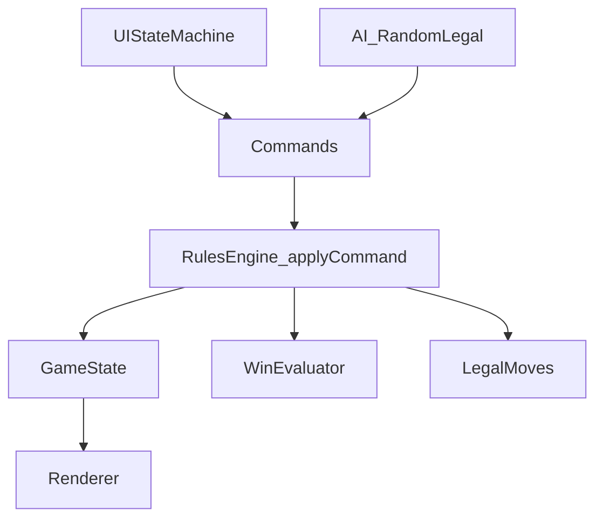

# Property Deal — Build Plan (MVP1)

This document captures the **shared MVP1 spec** and a **piece-by-piece implementation plan** for building Property Deal (Monopoly Deal–inspired) on **TIC-80 JS**.

## Goals + Constraints

- **Platform**: TIC-80 fantasy console, **JavaScript** (duktape)
- **Cartridge**: single pasted file output **`game.js`**
- **Constraints**: no DOM/Node/browser APIs, no external libs, ~64KB code limit
- **Target**: **1v1 player vs AI**, controller-first (Google TV couch play)
- **UI space**: 240×136 usable area

## Locked MVP1 Rules (Source of Truth)

### Win condition

- Win = **first player to 3 complete property sets**
- **Win check** runs after **every state change** that can affect sets/properties (including during debt/payment resolution), to avoid continuing after a win.

### Game start

- Shuffle deck
- Deal **5** cards to each player
- Choose first player **randomly** (uses our deterministic PRNG; seed is a constant in MVP1)

### Turn structure

- Start of turn: **draw 2**
- Main phase: **play up to 3 cards**
- End phase: **discard down to 7**

### MVP1 card pool (35-card deck)

#### Property ecosystem (14 property cards total)

Property sets in MVP1:

- **Magenta**: requires **3**
- **Orange**: requires **3**
- **Cyan**: requires **2**
- **Black**: requires **4**

Wild properties:

- **1×** dual-color **Magenta/Orange**
- **1×** dual-color **Cyan/Black**

Notes:

- **Overfill allowed**: a set/stack may exceed its required size; it is still one set.
- Rent calculation caps at the required size (see rent rules).

#### Buildings

- **House ×2** (House only in MVP1; no Hotel)

House rules:

- Can be played only onto a **completed** set
- **House bonus** adds to rent (see rent tables)
- If paying a debt from a set with a House, the owner must **pay/remove the House first**
  - House payment goes to the recipient’s **bank** (as money)

#### Action cards

Included action cards:

- **Rent (color)** ×5
- **Sly Deal** ×2
- **Just Say No** ×2

Just Say No (JSN):

- **Single-layer** only (no JSN-on-JSN chain in MVP1)
- Played from **hand** in a response window
- Does **not** consume plays (reaction, not an active-turn play)
- When JSN cancels an action: **both JSN and the canceled action go to discard**

#### Money cards

- **Money ×10**
- Values are small; **no 10-value** money in MVP1
- Recommended distribution: **1×3, 2×3, 3×2, 4×1, 5×1**

### Banking rules

- Bankable: **Money cards**, **Action cards**, and **House**
- Not bankable: **Property cards** (including Wilds)

### Debt/payment rules

- When a player owes money (e.g., Rent), the **payer chooses** what to pay with.
- Payment sources: **bank + properties only** (not hand).

Where paid cards go:

- Paid **money/actions/house** → recipient **bank**
- Paid **properties** → recipient **properties**

Placement UX for received properties:

- **No auto-placement in MVP1**
- Recipient performs an explicit **“faux-turn placement”** for each received property:
  - choose destination set or create new set
  - if Wild, choose active color and destination

### Rent rules (MVP1)

- Rent can be charged from **partial sets** (rent scales with current set size)
- Overfill does **not** increase rent beyond the set’s required size (rent caps at required size)

Concrete rent tables (Option A):

- **Cyan(2)**: \[1, 3]
- **Magenta(3)**: \[1, 2, 4]
- **Orange(3)**: \[1, 3, 5]
- **Black(4)**: \[1, 2, 3, 6]
- **House bonus**: **+3** (only when charging rent from a completed set that has a House)

### Property money values (for debt payment)

Properties are not bankable, but they have money values used to satisfy debts when paid as properties.

- Cyan properties: **more valuable than others** (exact number to tune; initial default **3M each**)
- Magenta properties: initial default **2M each**
- Orange properties: initial default **2M each**
- Black properties: initial default **1M each**
- Wild (M/O): initial default **2M**
- Wild (C/B): initial default **2M**

### Wild “replace-window” repositioning

Wild repositioning is intentionally constrained in MVP1.

- Repositioning is only available in a **replace-window** after playing a property into a set (including playing a Wild).
- At most **1 Wild** may be repositioned per play.
- Repositioning is included in the **same play** (no additional play cost).
- Player **chooses destination** (existing set or new set + color assignment).
- **Eligibility**: repositioning is only legal if removing the Wild would leave the **source set still complete**.

### Sly Deal targeting constraint

- Sly Deal may not steal from an opponent’s **complete** set.

## Locked UI Layout (5-row, deterministic)

Rows (top to bottom):

- Row 1: opponent hand backs, showing ~**11px** height
- Row 2: opponent table stacks (**~25px**)
- Row 3 (center): big card preview + description + draw/discard + both banks + prompts
- Row 4: player table stacks (**~25px**, selectable/highlight)
- Row 5: player hand full cards (**~25px**, selectable/highlight)

Overflow:

- If a property row has too many stacks to fit, the row becomes **horizontally scrollable** (row-local camera offset that follows selection).

### Navigation model

- **Zone-based cursor + UI state machine**
  - Left/Right: move within the active row/zone
  - Up/Down: switch rows/zones
  - `A`: confirm/select (opens context menu, chooses targets, confirms prompts)
  - `B`: back/cancel
  - A dedicated **Inspect/Zoom** button (e.g., `Y` or `X`) shows the highlighted card enlarged with text in the center panel

### Hand card action

- Pressing `A` on a hand card opens a **context menu** (card-dependent):
  - Property: place to new/existing set
  - Wild: place to eligible set + pick active color
  - Action: play (and/or bank if bankable)
  - Money: bank

### Center row selectables

- Center includes selectable: **draw pile**, **discard pile**, **both banks**, **info/preview**

## AI (MVP1)

AI is required in MVP1, but intentionally simple.

- Policy: **pure random legal move**
- UX: step-by-step narrated actions with a configurable delay (no skip in MVP1)
  - e.g. “AI: Played property”, then “AI: Started a new set”, etc.

## Dev/Testing Requirements

- RNG seed is a **constant** in MVP1 (memorable values like `1`, `2`, `3`, `4`, `1001`, `1002`…)
- We implement our own **deterministic PRNG** (do not rely on `Math.random()`), so shuffles/AI are reproducible.
- Scenario injection: a list of predefined edge-case starting states
  - Examples: forced Rent payment with only properties; JSN response; Wild replace eligibility; House-pay-first debt case

## Implementation Plan (Piece-by-piece)

### Phase 0 — Repo workflow

- Author modular code under `src/`
- Generate paste-ready `game.js` via a **light build step** (pure concatenation; no runtime deps)
- Ensure `game.js` includes required TIC-80 headers:
  - `// script: js`
  - `// title: Property Deal`

### Phase 1 — Foundations (data + RNG + state)

- Implement deterministic PRNG (seeded by a constant in MVP1) and deterministic shuffle
- Define card definitions (data-driven):
  - `CARD_DEFS` (id, kind, **name**, **description**, moneyValue, propertyColor/wildColors, action kind, counts)
  - `SET_RULES` (requiredSize, rentTable, UI color index)
- Define `GameState` structure:
  - deck, discard
  - per-player: hand, bank, propertySets (stacks), etc.
  - current turn, phase, playsRemaining
  - active prompts / UI mode state

### Phase 2 — Rules engine + commands API (single source of truth)

Implement a command-driven rules engine so **UI and AI share the same primitives**.

Core pieces:

- `legalMoves(state)` returns legal commands for the active player (and for prompts like payment/placement).
- `applyCommand(state, cmd)` mutates state deterministically and emits events/messages for UI.
- `evaluateWin(state)` checks 3 complete sets for either player.

Command examples (exact naming can vary, but shape should match):

- Play/bank:
  - Bank a card (money/action/house)
  - Play property/wild to a set
  - Play House onto a completed set
- Actions:
  - Play Rent (choose color / choose set)
  - Play Sly Deal (choose target property)
  - Play Just Say No (response window)
- Debt resolution:
  - Select payment cards from bank/properties
  - Transfer cards to recipient bank/properties
  - Recipient places received properties (faux-turn)
- Wild replace-window:
  - Optional “move 1 Wild from source set to destination”

### Phase 3 — Rendering + 5-row layout baseline

- Implement renderer for:
  - card rectangles, stack peeks, highlights
  - row scroll camera
  - center panel: preview + prompt text + bank totals + deck/discard counts
- Keep drawing deterministic: highlight drawn last; stacks draw top last.

### Phase 4 — UI state machine (controller UX)

- Implement selection model by zone:
  - opponent hand (inspect only)
  - opponent table (inspect/targetable for Sly Deal)
  - center piles/banks (selectable)
  - player table (selectable)
  - player hand (selectable)
- Implement context menu on `A` for hand cards
- Implement prompt flows in center panel:
  - choose rent color / choose set
  - choose Sly Deal target
  - payment selection UI
  - received property placement UI
  - wild replace-window prompt

### Phase 5 — Turn loop + discard down to 7

- Implement start-of-turn draw 2
- Track playsRemaining (3)
- Implement discard-down-to-7 at end of turn (selection UI)
- Reshuffle discard into deck when needed

### Phase 6 — Debt/payment + “faux-turn placement”

- Implement debt context:
  - payer selects from bank/properties
  - enforce House-pay-first rule
  - transfer to recipient (bank/properties)
- Implement recipient placement step for each received property, including Wild assignment

### Phase 7 — Actions + responses

- Implement Rent + JSN response window
- Implement Sly Deal + JSN response window + legality (not from complete set)

### Phase 8 — Wild replace-window

- Detect replace-window eligibility after property plays
- Offer optional prompt to move exactly 1 Wild if legal (source remains complete)

### Phase 9 — AI (random legal) + narrated pacing

- Implement AI as:
  - `legalMoves(state)` → choose random → enqueue commands
- Show narrated messages in center panel with fixed delay between steps

### Phase 10 — Scenarios + dev boot

- Implement scenario list and boot selection (e.g., hidden title-screen menu)
- (Optional later) implement seed display and seed override in dev

## Recommended file layout (after Phase 0)

- `src/`
  - `main.js` (TIC loop + wiring)
  - `rng.js`
  - `defs.js` (card + set rules)
  - `state.js`
  - `rules.js` (applyCommand, legalMoves, evaluators)
  - `ui/` (state machine, menus, prompts)
  - `render/` (layout + drawing)
  - `ai.js`
  - `scenarios.js`
- `scripts/build.mjs` (Node; generates `game.js`)
- `game.js` (generated, paste into TIC-80)

## Architecture sketch

